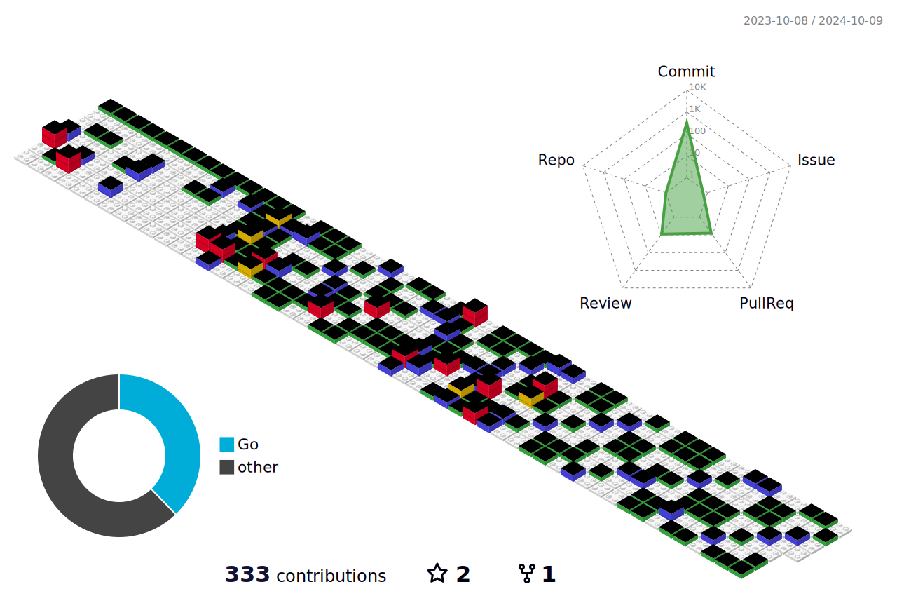

### Hi 👋

  

- 🌱 Currently focus on blockchain

- 📫 Contact **cryplo@foxmail.com**

### Recent Activity

<!--RECENT_ACTIVITY:start-->
1. 💪 Opened PR [#1236](https://github.com/33cn/plugin/pull/1236) in [33cn/plugin](https://github.com/33cn/plugin)
2. ⭐ Starred [ZenGo-X/multi-party-ecdsa](https://github.com/ZenGo-X/multi-party-ecdsa)
3. 💪 Opened PR [#1227](https://github.com/33cn/plugin/pull/1227) in [33cn/plugin](https://github.com/33cn/plugin)
4. 💪 Opened PR [#1273](https://github.com/33cn/chain33/pull/1273) in [33cn/chain33](https://github.com/33cn/chain33)
5. ⭐ Starred [smartcontractkit/full-blockchain-solidity-course-js](https://github.com/smartcontractkit/full-blockchain-solidity-course-js)
<!--RECENT_ACTIVITY:end-->

<!--RECENT_ACTIVITY:last_update-->
Last Updated: Saturday, December 3rd, 2022, 9:51:22 AM
<!--RECENT_ACTIVITY:last_update_end-->

<!-- ### 📊 GitHub Stats: -->
 
<!--   -->
<!--  -->

<!-- ### 💻 Tech Stack: -->

<!-- Blockchain  -->

<!--  -->
<!--  -->
<!--  -->

<!-- Program language -->

<!--  -->
<!--  -->
<!--  -->
<!--  -->
<!--  -->
<!--  -->

<!-- DB -->

<!--  -->
<!--  -->
<!--  -->

<!-- Devops -->

<!--  -->
<!--  -->
<!--  -->
<!--  -->
<!--  -->

<!-- Version control -->

<!--  -->
<!--  -->
<!--  -->

<!-- ### 🏆 GitHub Trophies -->
<!--  -->

<!--  -->
